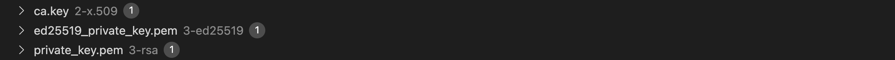
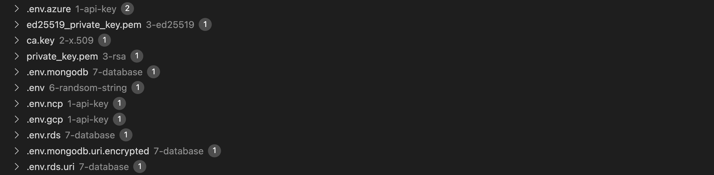

# Trivy vs Vault Rdara

This document compares the performance, speed of Trivy and Vault Radar.

All scripts are based on [Trivy Use Case (en)]() and [Vault Rdara Use Case (en)]().

> For repository purpose, I talk about `result of compare` at the beginning, followed by [Install](./README_en.md#installation), [Configuration](./README_en.md#configuration) and [Get-Started](./README_en.md#get-started)

## Translation

- Korean : [open](./READMD_ko.md)
- English : [open](./READMD_en.md)

## Result

(without specific setting)<br>
You can see that Vault Radar hase better overall dtection performance compared to Trivy.<br>
I especially liked the recognition of certian string pattern (API Key*, DB Params*).

One thing that both F1s lacked was detection of various encrypted strings. <br>
I thought it would be nice to be able to detect and review them at the F10 LOG, MIDDLE level as well.

<details>
<summary>Trivy Result</summary>


</details>

<details>
<summary>Vault Radar Result</summary>


</details>

| No. | Option                                               | Trivy                      | Vault Radar                                |
| --- | ---------------------------------------------------- | -------------------------- | ------------------------------------------ |
| 1   | API Key (aws, gcp, ncp, azure)                       | detect restricted format\* | detect all format\*                        |
| 2   | X.509 (key, csr, crt key)                            | detect `key` only          | detect `key` only                          |
| 3   | RSA, ED25519 (priv, pub key)                         | detect `priv` only         | detect `priv` only                         |
| 4   | Encoded String (base32, base64)                      |                            |                                            |
| 5   | MD5, SHA-1, SHA-256, SHA3-256, PBKDF2, Argon2        |                            |                                            |
| 6   | Random String                                        |                            |                                            |
| 7   | DB Params (MongoDB URI, RDS URI, Username, Password) |                            | detect specific key format (e.g. password) |
| 8   | AI Model                                             |                            |                                            |
| 9   | Blockchain Contract                                  |                            |                                            |
| 10  | PCI-SSC (Username, Location, ID, Passport)           |                            |                                            |

## Installation

```shell
brew install gh
brew install trivy
brew install vault-radar
```

## Configuration

For hands-on practice with F2 Vault Radar, see this article.

```shell
DOCKER_API_VERSION=1.45
VAULT_RADAR_GIT_TOKEN="<PAT>"   # GitHub Personal Access Token
HCP_PROJECT_ID="<VALUE>"        # HCP Vault Radar
HCP_CLIENT_ID="<VALUE>"         # HCP IAM
HCP_CLIENT_SECRET="<VALUE>"     # HCP IAM
```

## Get Started

Run this command, after configuration

```shell
trivy fs . -f sarif > trivy.sarif

DOCKER_API_VERSION=1.45           \
    VAULT_RADAR_GIT_TOKEN=<VALUE> \
    HCP_PROJECT_ID=<VALUE>        \
    HCP_CLIENT_ID=<VALUE>         \
    HCP_CLIENT_SECRET=<VALUE>     \
    vault-radar scan folder       \
        -p ./                     \
        -f sarif                  \
        -o sarif.log
```
